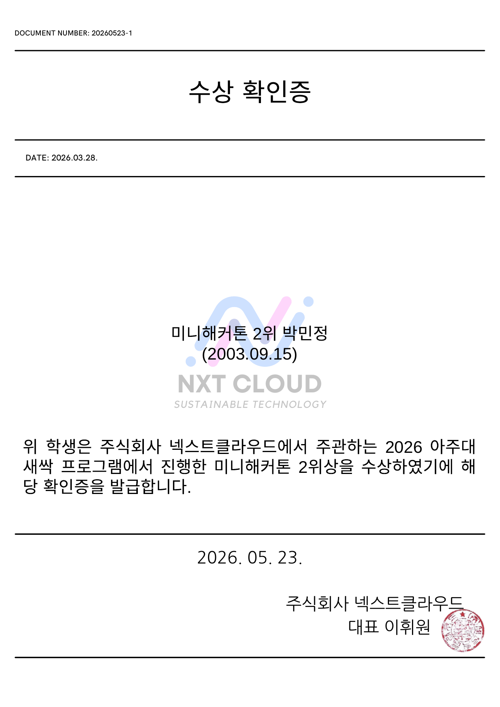

# Pokemon2 Online - 포켓몬 스타일 웹 RPG 리팩토링 프로젝트

## Demo

[http://ajuuniv-06-kiro.s3-website-us-east-1.amazonaws.com/](http://ajuuniv-06-kiro.s3-website-us-east-1.amazonaws.com/)

## 프로젝트 소개

**Pokemon2 Online**은 기존 포켓몬 스타일 싱글플레이 웹 게임 데모를 리팩토링하고, 온라인 멀티플레이와 서버 저장 기능을 확장한 프로젝트입니다.

초기 버전은 스타팅 몬스터 선택, 마을/필드 탐험, NPC 대화, 라이벌 이벤트, 턴제 전투를 중심으로 한 Canvas 기반 웹 RPG였습니다. 현재 저장소에서는 기존 클라이언트 구조를 정리하면서 **ASP.NET Core WebSocket 서버, Room Actor 기반 실시간 동기화, PostgreSQL 세이브 슬롯, 서버 권위형 이동/전투 판정, 부하 테스트 및 운영 메트릭**을 추가했습니다.

넥스트클라우드 2026 AJOU AWS 프로그램에서 Kiro와 Codex를 활용해 제작 및 확장했습니다.

## 수상내역

아주대학교 새싹 프로그램 미니해커톤 2위 수상 증빙입니다.

<table>
  <tr>
    <td align="center">
      
      <br />
      <strong>아주대학교 새싹 미니해커톤 2위 상장</strong>
    </td>
    <td align="center">
      
      <br />
      <strong>아주대학교 새싹 미니해커톤 2위 수상 확인증</strong>
    </td>
  </tr>
</table>

## 주요 기능

### 필드 탐험 시스템

- 타일 기반 맵 이동
- 마을, 도로, 건물 구조 구현
- 맵 간 이동 및 충돌 처리
- 클라이언트 런타임 분리로 맵/입력/대화/저장 로직 정리

### NPC 상호작용

- NPC 대화 시스템
- 이벤트 기반 트리거
- 라이벌 등장 이벤트
- 선택지 기반 대화 UI

### LLM 기반 라이벌 대화

- 라이벌 캐릭터와 자유 대화 가능
- 백엔드 LLM 프록시 연동
- 게임 세계관을 유지하도록 프롬프트 제어

### 턴제 전투 시스템

- 플레이어 vs 적 몬스터 전투
- 경험치 및 레벨업 시스템
- 공격, 스킬, 도망 기능
- 전투 로그 출력
- 온라인 서버 확장 시 서버 권위형 전투 판정 구조 추가

### 마을 시스템

- 시작 마을
- 나팔꽃마을
- 포켓몬센터 회복 기능

### 상태 저장

- PostgreSQL 기반 서버 세이브 슬롯 API
- 싱글/멀티 모드 저장 데이터 분리
- 3개 세이브 슬롯
- 서버 저장 실패 시 `localStorage` fallback
- 맵 위치, 레벨, HP, 이벤트 상태 유지

## 온라인 서버 확장

이 저장소는 기존 작품을 온라인 포트폴리오용으로 리팩토링한 버전입니다. 단순 정적 웹 데모에서 끝나지 않도록, 2~4인 동시 플레이를 가정한 서버 구조를 추가했습니다.

- ASP.NET Core 기반 HTTP/WebSocket 서버
- Room Actor 기반 방 단위 command queue
- 20Hz tick loop
- 서버 권위형 이동 판정
- 동시 이동 충돌 거부
- WebSocket 실시간 스냅샷 동기화
- 서버 권위형 전투 판정 및 결과 저장
- PostgreSQL 세이브 슬롯 API
- 운영 메트릭 API
- C# WebSocket 봇 클라이언트
- Artillery 기반 부하 테스트 시나리오

자세한 서버 설계와 트러블슈팅 내용은 [docs/server-portfolio.md](./docs/server-portfolio.md)를 참고하세요.

## 기술 스택

### Frontend

- HTML
- CSS
- JavaScript
- Canvas 2D Rendering
- ES Modules
- `localStorage`

### Backend / Online Server

- C# / .NET 10
- ASP.NET Core Minimal API
- WebSocket
- Room Actor + Command Queue
- PostgreSQL
- EF Core / Npgsql

### Test / Load Test / Observability

- Node.js test runner
- xUnit
- C# 봇 클라이언트
- Artillery
- Datadog DogStatsD 연동 구조

### Deployment

- AWS S3 정적 호스팅
- Docker Compose 기반 로컬 PostgreSQL

## 실행 방법

### 1. 클라이언트 로컬 실행

```bash
cd client
python3 -m http.server 8000
```

브라우저에서 [http://localhost:8000](http://localhost:8000)에 접속합니다.

### 2. PostgreSQL 실행

```bash
docker compose up -d postgres
```

기본 개발 DB 설정은 `docker-compose.yml`과 `.env.example`을 기준으로 합니다.

### 3. 온라인 서버 실행

```bash
dotnet run --project server/Pokemon2.Server/Pokemon2.Server.csproj
```

기본 서버 주소는 `http://localhost:5140`입니다. 클라이언트 메인 메뉴의 설정에서 서버 주소를 변경할 수 있습니다.

### 4. 테스트 실행

```bash
npm run test:client
dotnet test server/Pokemon2.Online.slnx
```

### 5. 부하 테스트

```bash
npm run load:artillery:rooms
npm run load:artillery:hot-room
```

## 주요 API

```http
GET /api/health
POST /api/sessions/single
GET /api/rooms
POST /api/rooms
POST /api/rooms/{roomId}/join
GET /api/saves?mode={single|multi}
POST /api/saves
GET /api/saves/{saveId}
PUT /api/saves/{saveId}
DELETE /api/saves/{saveId}
GET /api/admin/metrics
GET /ws/game?roomId={roomId}&playerName={name}
```

## 프로젝트 구조

```text
client/
  index.html
  style.css
  data/
  src/
    app/
    battle/
    data/
    game/

server/
  Pokemon2.Server/
  Pokemon2.Server.Tests/
  Pokemon2.LoadTest/

docs/
  backlog.md
  development-todo.md
  server-portfolio.md
  datadog-observability.md

CHANGELOG.md

load-tests/
  artillery/

assets/
  awards/
```

## 주의사항

- LLM API 키는 `server/.env` 또는 서버 런타임 환경변수에만 둡니다.
- 클라이언트는 `/api/llm/*` 백엔드 프록시를 통해서만 LLM 기능을 사용합니다.
- 현재 온라인 서버는 포트폴리오 목적의 구조 확장 버전이며, 운영 서비스 수준의 인증/보안/매칭 시스템은 별도 보강이 필요합니다.

## 개발 문서

- 변경 이력: [CHANGELOG.md](./CHANGELOG.md)
- 남은 핵심 개발 항목: [docs/development-todo.md](./docs/development-todo.md)
- backlog 기록: [docs/backlog.md](./docs/backlog.md)

## Author

**박민정**  
아주대학교 소프트웨어학과
